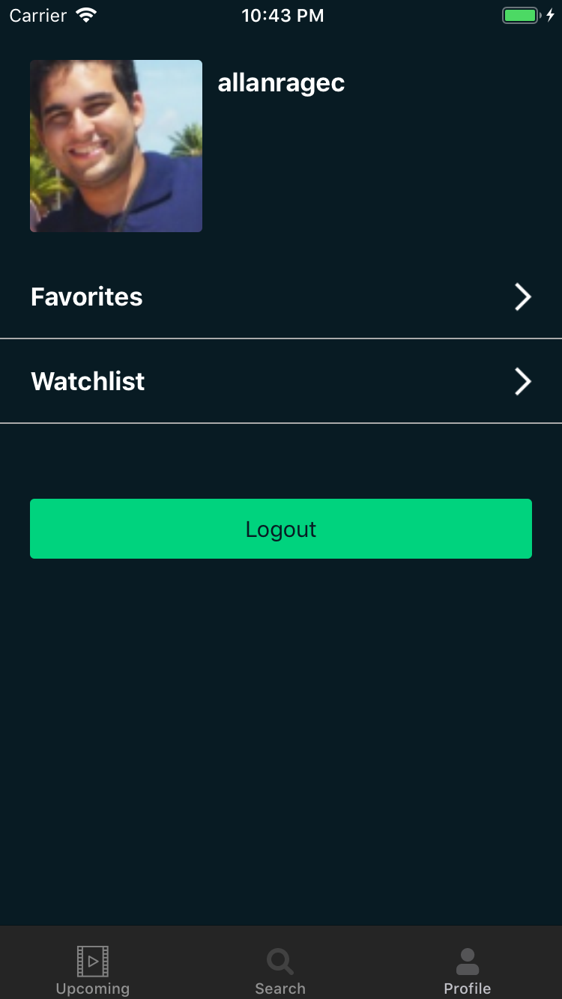
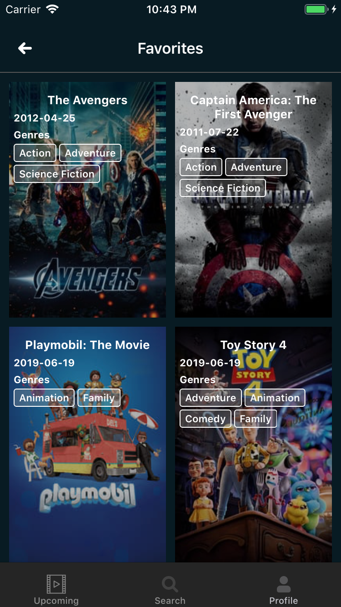
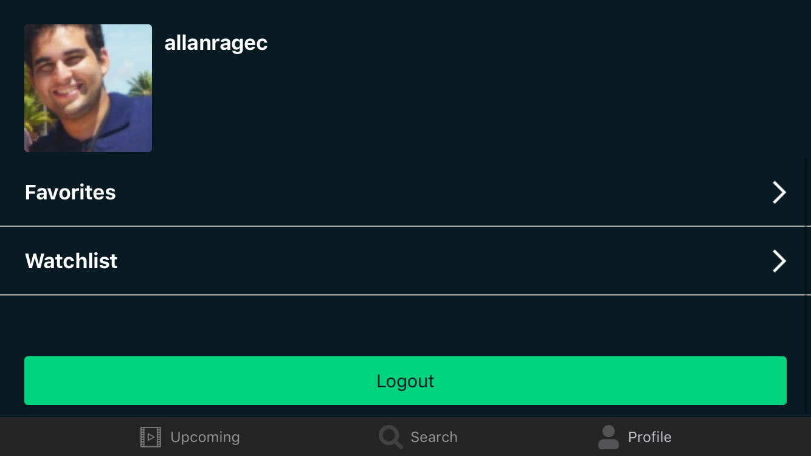
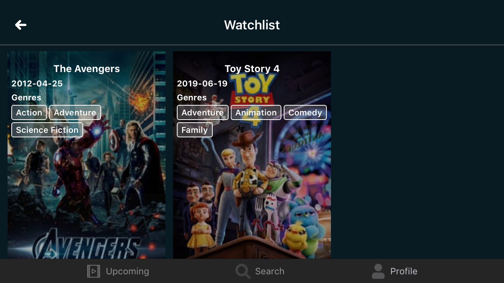

# Movies App

Movies app written in Swift 4 using the TMDb API.

# How to build ?
1. You need [Cocoapods](https://cocoapods.org/) installed.
2. Run `$ pod install` in root of project directory.
3. This will download the project dependencies and create a .xcworkspace
file, use that file to open the project in Xcode.
4. You need to create an API Key in https://www.themoviedb.org/ and put in Setting.swift file in API_KEY constant.

## Third-party libraries

### RxSwift (https://github.com/ReactiveX/RxSwift)
Rx is a generic abstraction of computation expressed through Observable<Element> interface.

### RxBlocking (https://github.com/ReactiveX/RxSwift/tree/master/RxBlocking)
Set of blocking operators for easy unit testing.

### RxCocoa (https://github.com/ReactiveX/RxSwift/tree/master/RxCocoa)
Provides Cocoa-specific capabilities for general iOS/macOS/watchOS & tvOS app development, such as Binders, Traits, and much more. It depends on both RxSwift and RxRelay.

### NSObject-Rx (https://github.com/RxSwiftCommunity/NSObject-Rx)
Handy RxSwift extensions on NSObject, including rx.disposeBag.

### SDWebImage (https://github.com/SDWebImage/SDWebImage)
This library provides an async image downloader with cache support.

### KeychainSwift (https://github.com/evgenyneu/keychain-swift)
Helper functions for saving text in Keychain securely for iOS, OS X, tvOS and watchOS. In the app, it is used to save the Session Id and Account Id of the signed in user.

### AlignedCollectionViewFlowLayout (https://github.com/mischa-hildebrand/AlignedCollectionViewFlowLayout)
A collection view layout that gives you control over the horizontal and vertical alignment of the cells. You can use it to align the cells like words in a left- or right-aligned text and you can specify how the cells are vertically aligned within their rows.

### UICircularProgressRing (https://github.com/luispadron/UICircularProgressRing)
A circular progress bar for iOS written in Swift.

# Screenshots

## Portrait
 
 
 
 

## Landscape

## Author

Allan Melo, allanragec@gmail.com